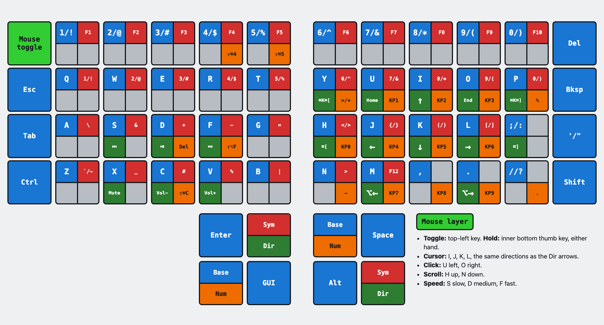

# dactyl-corne

A QMK keymap for a handwired Dactyl ManuForm 5x6 — a 64-key split
keyboard, five layers, with tap dances, combos and a mouse layer.

Keymap source:
[`keyboards/handwired/dactyl_manuform/5x6/keymaps/dactyl_corne/`](keyboards/handwired/dactyl_manuform/5x6/keymaps/dactyl_corne/)

## The board

|            |                                                 |
| ---------- | ----------------------------------------------- |
| Controller | Arduino Pro Micro (ATmega32U4)                  |
| Bootloader | Caterina                                        |
| Halves     | Split, handedness stored in EEPROM (`EE_HANDS`) |
| Keys       | 64                                              |

Key count breaks down per hand as 4 full rows of 6, a partial row of 2,
and a 6-key thumb cluster. The partial row is not bound to anything on
any layer.

Hardware config is QMK's stock `handwired/dactyl_manuform/5x6` — no
custom wiring. Change
[`config.h`](keyboards/handwired/dactyl_manuform/5x6/keymaps/dactyl_corne/config.h)
if your build differs.

## Layout



Generated from [`docs/keymap-layers.html`](docs/keymap-layers.html) — open that in
a browser, screenshot it, and save the image as `docs/keymap-layers.png`.

Each key is divided into quadrants, one per layer: Base (blue), Sym
(red), Dir (green), Num (orange). A quadrant is coloured only where that
layer changes the key; grey means it passes through to Base. The two
layer keys in each thumb cluster are split top and bottom — top is what
you get on tap, bottom is what you get on hold.

The mouse toggle key is lime green. The mouse layer's bindings are listed
as text beside the right thumb cluster.

## Layers

| Layer | How to reach it                                             |
| ----- | ----------------------------------------------------------- |
| Base  | default — tap the `Base/Num` key to come back to it         |
| Sym   | tap the `Sym/Dir` key                                       |
| Dir   | hold the `Sym/Dir` key                                      |
| Num   | hold the `Base/Num` key                                     |
| Mouse | tap the top-left key, or hold either inner bottom thumb key |

`Sym/Dir` and `Base/Num` each appear once per hand, in mirrored thumb
positions, so either hand can reach either layer.

Combos are resolved from the base layer, so they work on every layer.

### Base

Standard QWERTY across the three main rows. The top row is a number row
where every digit is a tap dance — tap for the digit, hold for its
shifted symbol, so `1`/`!`, `2`/`@` and so on. `;`/`:`, `'`/`"` and
`/`/`?` work the same way.

The top-left key toggles the mouse layer; the top-right is Delete.

### Sym

F1–F10 on the number row, numbers on the row below it, then brackets,
braces, parens and the common programming symbols under the right hand,
with `\`, `&`, `+`, `-`, `=`, backtick/tilde, underscore, `#`, `%` and
pipe under the left.

### Dir

Arrow cluster on I/J/K/L with Home and End beside it. Media transport
and volume under the left hand.

Y and P send editor fold and unfold (`⌘K ⌘[` and `⌘K ⌘]`).

### Num

Numpad under the right hand — `1`–`9` and `0` in a keypad arrangement,
with `=`/`+`, `-` and `.`.

The 4 and 5 keys on the number row send `⇧⌘4` and `⇧⌘5`, the macOS
screen capture shortcuts.

### Mouse

| Function      | Keys                          |
| ------------- | ----------------------------- |
| Cursor        | I up, J left, K down, L right |
| Left click    | U                             |
| Right click   | O                             |
| Scroll        | H up, N down                  |
| Pointer speed | S slow, D medium, F fast      |

Cursor movement sits on the same keys the arrows use on Dir. Requires
`MOUSEKEY_ENABLE`, set in
[`rules.mk`](keyboards/handwired/dactyl_manuform/5x6/keymaps/dactyl_corne/rules.mk).

## Thumb clusters

Three rows of two per hand, cascading inward and down. The hands mirror
each other. Outer key first, then inner:

| Row    | Left hand           | Right hand          |
| ------ | ------------------- | ------------------- |
| Top    | Enter, `Sym/Dir`    | Space, `Base/Num`   |
| Middle | `Base/Num`, GUI     | `Sym/Dir`, Alt      |
| Bottom | unbound, Mouse hold | unbound, Mouse hold |

## Combos

| Keys    | Result    |
| ------- | --------- |
| Q + W   | Esc       |
| S + D   | Tab       |
| I + O   | Backspace |
| Y + U   | Delete    |
| D + F   | Shift     |
| J + K   | Shift     |
| X + V   | Ctrl      |
| M + .   | Ctrl      |
| V + B   | Alt       |
| K + L   | `'` / `"` |
| F+G+H+J | Caps Word |
| D+F+J+K | Caps Lock |

## Setup

You need the QMK CLI, a build toolchain, and `avrdude` to flash.
`qmk doctor` reports what it can find, and is the check to run if
anything below fails.

### macOS

Written for macOS 15.3.2 on Apple Silicon.

Install [Homebrew](https://brew.sh) first, then:

```sh
curl -fsSL https://install.qmk.fm | sh
```

```sh
qmk setup
```

Answer `y` to the prompts. Then install the flashing utility:

```sh
brew install avrdude
```

Confirm the environment:

```sh
qmk doctor
```

### Windows 10

Install [QMK MSYS](https://msys.qmk.fm/) — latest release
[here](https://github.com/qmk/qmk_distro_msys/releases/latest). It bundles
MSYS2 and the QMK CLI.

Open QMK MSYS and run:

```sh
qmk setup
```

Answer `y` to the prompts. Then install the flashing utility:

```sh
pacman -S mingw-w64-x86_64-avrdude
```

Confirm the environment:

```sh
qmk doctor
```

Run everything below from the QMK MSYS terminal.

### Point QMK at this repo

This repo is a QMK external userspace — it holds only the keymap and
builds against upstream `qmk_firmware` rather than forking it.

```sh
qmk config user.overlay_dir="$(realpath /path/to/dactyl-corne)"
```

### Compile

```sh
qmk compile -kb handwired/dactyl_manuform/5x6 -km dactyl_corne
```

Get a clean compile before touching the hardware.

## Flashing

### First time — set handedness

Each half stores its own handedness in EEPROM. These commands write that
value and flash the firmware in one go, so this doubles as the first
flash.

Connect one half at a time, and put it in bootloader mode before running
the command.

Left half:

```sh
qmk flash -kb handwired/dactyl_manuform/5x6 -km dactyl_corne -bl avrdude-split-left
```

Right half:

```sh
qmk flash -kb handwired/dactyl_manuform/5x6 -km dactyl_corne -bl avrdude-split-right
```

### Every time after

Handedness persists through normal flashes, so later updates use the
plain command — still one half at a time, each in bootloader mode:

```sh
qmk flash -kb handwired/dactyl_manuform/5x6 -km dactyl_corne
```

You only need the split commands again if the EEPROM gets wiped by
something outside the firmware.

## Building in CI

[`qmk.json`](qmk.json) registers this keymap as a build target, and
[`.github/workflows/build_binaries.yaml`](.github/workflows/build_binaries.yaml)
calls QMK's official reusable workflows. Pushing to a GitHub fork with
Actions enabled builds the firmware there.
